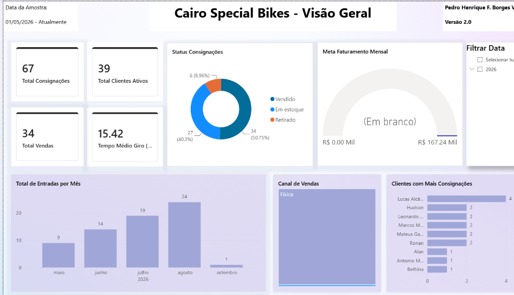
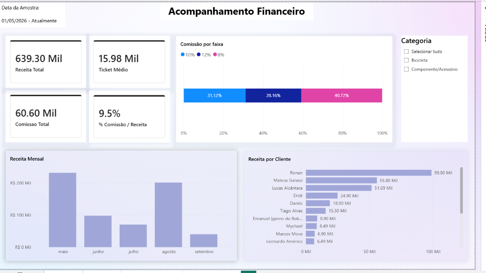
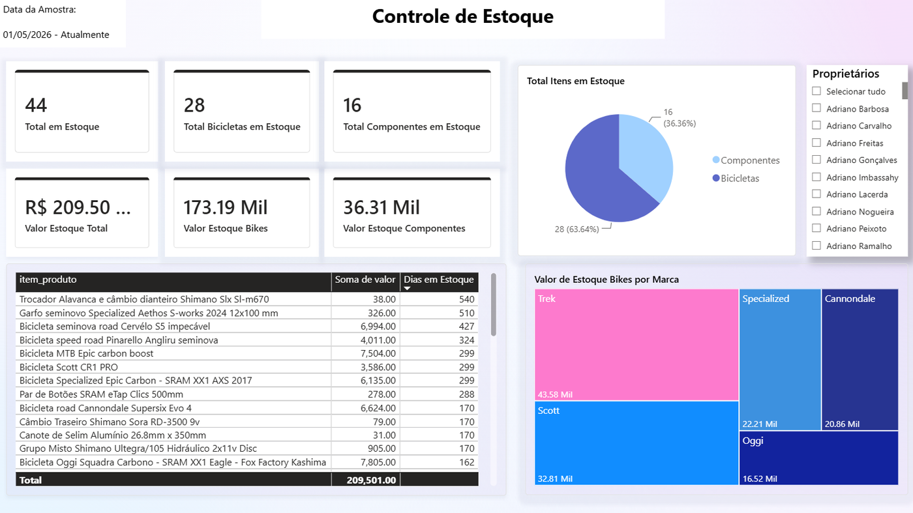
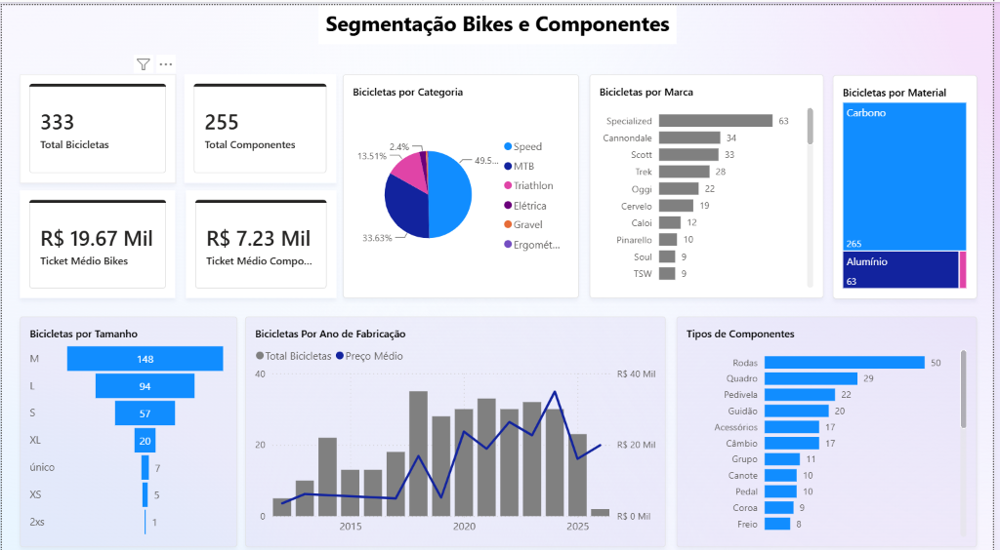
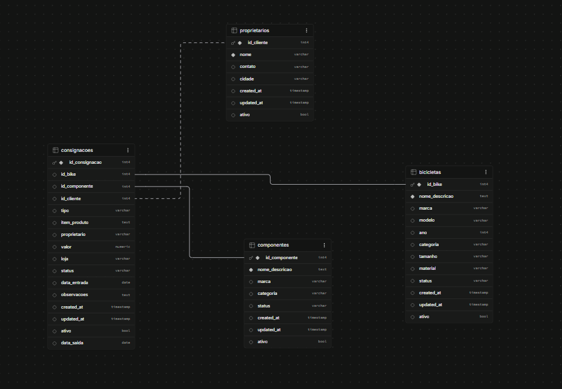

# Cairo Special Bikes — Pipeline de Dados

Pipeline de ETL (Extract, Transform, Load) desenvolvido para uma loja de consignação de bicicletas, automatizando a sincronização de dados operacionais de uma planilha do Google Sheets para um banco de dados PostgreSQL na nuvem (Supabase), servindo de base para dashboards em Power BI.

> 💡 Projeto de consultoria de dados real, desenvolvido para a Cairo Special Bikes (Uberlândia, MG). Este repositório contém apenas o código do pipeline — nenhum dado de clientes ou credencial está versionado aqui.

## Sobre

A loja registrava suas operações (consignações de bicicletas e componentes, cadastro de proprietários, resumo mensal de vendas) manualmente em planilhas do Google Sheets. Este pipeline automatiza a extração, limpeza e carga desses dados em um banco relacional, eliminando o retrabalho manual e viabilizando análises consistentes em Power BI.

## Arquitetura

```
Google Sheets  →  Extract  →  Transform  →  Load  →  Supabase (PostgreSQL)  →  Power BI
                 (gspread)   (pandas)     (REST API)
```

O pipeline roda automaticamente a cada 2 horas via **GitHub Actions**, mantendo o banco sempre sincronizado com a planilha sem intervenção manual.

## Estrutura

```
pipeline/
├── extract.py     → lê as 5 abas da planilha (Google Sheets API)
├── transform.py   → limpa, valida e padroniza os dados
├── load.py        → envia os dados para o Supabase via REST API (upsert)
└── main.py         → orquestra as 3 etapas do pipeline

.github/workflows/
└── sync.yml         → agenda a execução automática (cron a cada 2h)
```

## O que o pipeline faz

**Extract** (`extract.py`)
Conecta à planilha do Google Sheets via API (`gspread`) e lê as 5 abas: Consignações, Proprietários, Bicicletas, Componentes e Resumo Mensal.

**Transform** (`transform.py`)
- Padroniza valores de status (ex: variações de "vendido" e "em estoque" viram um valor único)
- Converte e valida datas, descartando datas inconsistentes
- Normaliza valores monetários em diferentes formatos (`R$ 1.234,56`, `1234.56`, etc.) para `float`
- Valida integridade referencial: descarta consignações que apontam para bicicletas ou componentes inexistentes
- Reporta no console quantos registros foram validados ou descartados em cada tabela

**Load** (`load.py`)
Envia os dados tratados para o Supabase via REST API, usando `upsert` (insere ou atualiza sem duplicar) em lotes de 100 registros por requisição.

## Dashboard

Os dados carregados no Supabase alimentam um dashboard em Power BI com 4 páginas: visão geral, financeiro, estoque e segmentação de produtos.

> *Nomes de clientes ocultados por privacidade. Capturas de tela ilustrativas de um dos dashboards produzidos no projeto.*

**Visão Geral**


**Acompanhamento Financeiro**


**Controle de Estoque**


**Segmentação de Bikes e Componentes**


## Estrutura dos dados

Uma planilha de exemplo com a mesma arquitetura de dados está disponível em [`docs/dados_exemplo.xlsx`](docs/dados_exemplo.xlsx) — nomes de clientes e valores foram anonimizados/embaralhados, mantendo a estrutura de tabelas e relacionamentos.

> A aba "Resumo Mensal" (indicadores financeiros consolidados da loja) não foi incluída, por conter informações sensíveis do negócio.

As tabelas principais são:

- **Proprietários** — cadastro de clientes consignantes
- **Bicicletas** / **Componentes** — itens em consignação (marca, modelo, categoria, status)
- **Consignações** — tabela central, ligando cliente + item + valor + status (vendido, em estoque, retirado)

## Banco de Dados e Consultas

O modelo de dados relacional foi desenhado para suportar as análises e dashboards do projeto.



Além do pipeline, o projeto conta com um arquivo de consultas SQL (`consultas.sql`) na raiz do repositório. Esse arquivo contém *queries* úteis para extração rápida de informações diretamente do banco de dados (Supabase/PostgreSQL), tais como:

- Buscas específicas (por nome de cliente, bicicleta, componente ou ID)
- Análises de clientes (clientes com mais consignações, maiores valores)
- Consultas de estoque (itens disponíveis, tempo em estoque)
- Métricas financeiras e de ticket médio (por categoria, marca, ano, receita mensal)

Essas *queries* servem de base para validação dos dados e criação de métricas avançadas.

## Automação

O arquivo `.github/workflows/sync.yml` configura uma **GitHub Action** que executa o pipeline automaticamente a cada 2 horas (`cron: '0 */2 * * *'`), além de permitir disparo manual. As credenciais (chaves do Supabase, credenciais do Google e ID da planilha) ficam armazenadas como *Secrets* do GitHub, nunca expostas no código.

## Segurança

- Credenciais nunca são commitadas: uso de variáveis de ambiente (`.env`, ignorado via `.gitignore`) em desenvolvimento local e *GitHub Secrets* em produção
- Nenhum dado de cliente está presente neste repositório — apenas o código do pipeline

## Tecnologias

- **Python** — pandas, gspread, google-auth, requests
- **Google Sheets API** — fonte de dados operacional
- **Supabase (PostgreSQL)** — banco de dados na nuvem
- **GitHub Actions** — orquestração e agendamento automático
- **Power BI** — camada de visualização (dashboards consumindo o Supabase)

---

📫 Encontre meus outros projetos de dados em [github.com/pedrinvazzz-code](https://github.com/pedrinvazzz-code)
