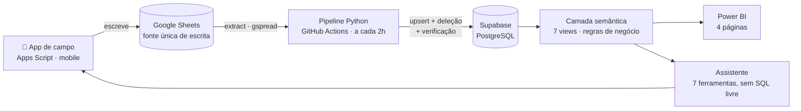
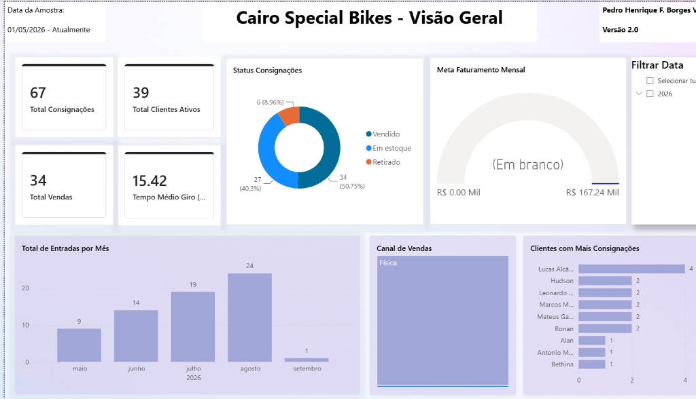
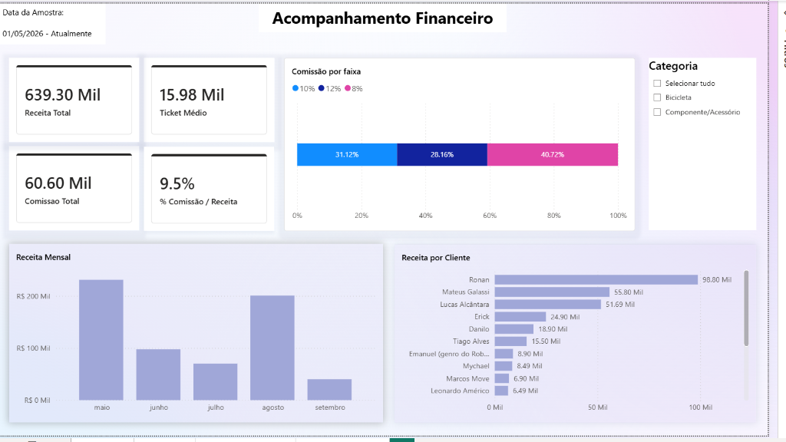
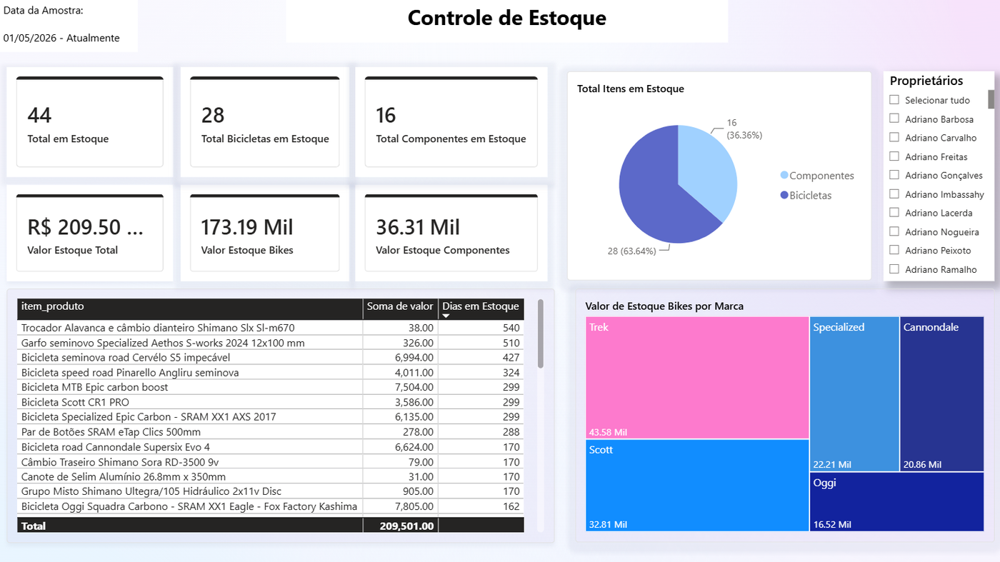
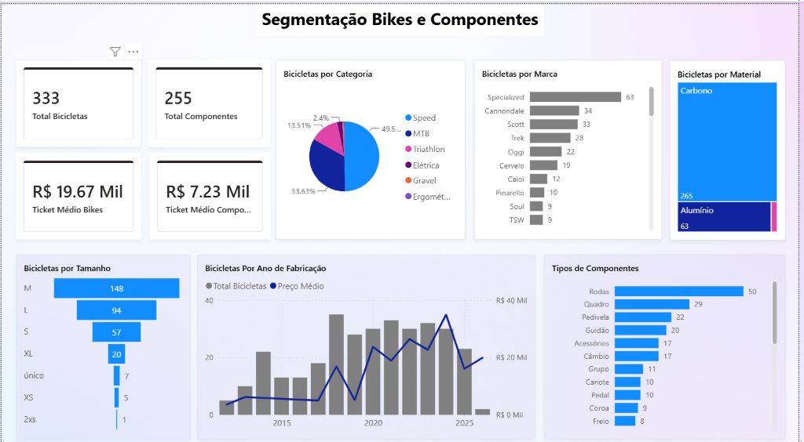
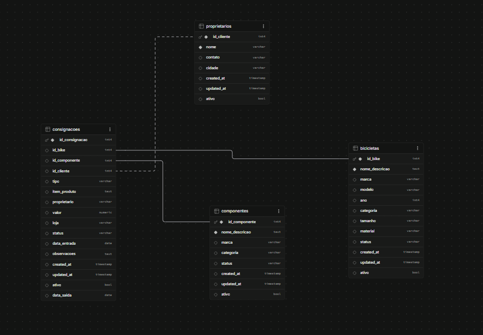

# Cairo Special Bikes — Plataforma de Dados

Plataforma de dados de ponta a ponta para uma loja de consignação de bicicletas: um **aplicativo de campo** que grava na planilha, um **pipeline de ETL** que sincroniza a planilha com um PostgreSQL na nuvem, uma **camada semântica em SQL** que concentra as regras de negócio, **dashboards em Power BI** e um **assistente em linguagem natural** que responde perguntas sobre o negócio sem escrever SQL.

> Projeto de consultoria de dados real, desenvolvido para a Cairo Special Bikes (Uberlândia, MG). **Em produção desde abril de 2026** e em uso diário pela loja.

> [!IMPORTANT]
> **Nenhuma imagem deste repositório mostra dados de clientes ou valores reais da loja.**
> - **Aplicativo:** capturas feitas sobre uma base **100% inventada**: nomes, itens, valores e datas.
> - **Power BI:** base de demonstração em que **nomes de clientes são fictícios** e **valores em R$ foram alterados** (escala reduzida e ruído por item). Datas e status seguem a estrutura real, sem identificar ninguém, porque são eles que sustentam a análise de qualidade de dados.
>
> Nenhum dado de cliente, valor de venda ou credencial está versionado aqui.

---

## Em 30 segundos

| | |
|---|---|
| **Problema** | A operação vivia em 12 planilhas preenchidas à mão, com datas inconsistentes, valores em formatos misturados e a mesma regra de negócio reescrita em vários lugares. Não dava para confiar em faturamento, giro ou estoque. |
| **O que construí** | Aplicativo mobile (Apps Script) → Google Sheets → ETL em Python (GitHub Actions, a cada 2h) → Supabase/PostgreSQL → 7 views com as regras de negócio → Power BI e um assistente com ferramentas parametrizadas. |
| **Resultado** | Uma fonte única de escrita, uma definição única de cada métrica, carga que falha alto em vez de gravar errado em silêncio, e uma janela de análise confiável declarada **no próprio dado**. |
| **Destaques técnicos** | Auditoria de qualidade que encontrou uma estimativa de migração contaminando 2/3 da receita histórica; um bug de parser que passou por **1.236 execuções verdes**; RLS e papéis no Postgres; concorrência otimista e trilha de auditoria no app; 67 testes automatizados. |

---

## Arquitetura


```mermaid
flowchart LR
    APP["📱 App de campo<br/>Apps Script · mobile"] -->|escreve| SHEET[("Google Sheets<br/>fonte única de escrita")]
    SHEET -->|extract · gspread| ETL["Pipeline Python<br/>GitHub Actions · a cada 2h"]
    ETL -->|upsert + deleção<br/>+ verificação| DB[("Supabase<br/>PostgreSQL")]
    DB --> VIEWS["Camada semântica<br/>7 views · regras de negócio"]
    VIEWS --> BI["Power BI<br/>4 páginas"]
    VIEWS --> AGENT["Assistente<br/>7 ferramentas, sem SQL livre"]
    AGENT --> APP
```

**Uma direção de escrita.** A planilha é o único lugar onde se escreve: o app grava nela, o pipeline lê dela, e tudo depois do banco é leitura. Isso elimina a pergunta "qual das versões está certa?", que era o problema original da loja.

---

## Decisões de engenharia (e o trade-off de cada uma)

**1. Manter a planilha como fonte, em vez de migrar a loja para um banco.**
A equipe já sabia usar a planilha, e trocar a ferramenta de trabalho de um pequeno varejo é caro e arriscado. O custo foi o trabalho no *Transform*: boa parte do código existe para lidar com digitação humana (datas incompletas, `R$ 1.234,56` e `1,234.56` na mesma coluna, `on line`/`on-line`/`online`) sem descartar o registro.

**2. Regras de negócio em views SQL, e não no Power BI nem no código.**
A regra de comissão por faixa estava escrita em **quatro lugares**. Três concordavam; um não, porque as medidas DAX que repartiam a comissão por faixa não tinham filtro de período e somavam o histórico inteiro. O total fechava e só a repartição estava errada, o tipo de defeito que passa em revisão. Hoje cada regra existe **uma vez**, em `sql/views.sql`, e o Power BI e o assistente leem de lá.

**3. O assistente não escreve SQL: escolhe entre 7 ferramentas.**
Um modelo gerando consulta do zero decidiria sozinho o que o projeto levou meses fechando: calcularia giro pela média em vez da mediana, contaria item *retirado* como receita, leria um mês pré-corte como se fosse confiável. A regra certa não está na pergunta, está no histórico do projeto. As ferramentas devolvem **a conta pronta**, não linhas: na primeira versão, a de estoque devolvia registros e o modelo contava sozinho, usando `> 90 dias` onde a regra é `>= 90`. A correção foi tirar a fronteira do alcance do modelo.

**4. A carga falha alto.**
Qualquer lote rejeitado derruba o job com código de saída diferente de zero, e uma etapa de verificação pós-carga confere as contagens tabela a tabela e procura sinais de valor implausível. Motivo: *execução verde não é prova de dado certo* (veja os postmortems abaixo).

**5. A deleção tem trava.**
Registro apagado na planilha precisa sumir do banco, mas uma leitura incompleta da API pareceria uma exclusão em massa. Acima de 50 exclusões numa rodada, o pipeline avisa e **não apaga**, partindo do princípio de que isso é leitura incompleta, e não exclusão real.

**6. Segurança por papel no banco, não por cuidado no código.**
RLS ligada em todas as tabelas, sem policy. As views internas têm acesso revogado explicitamente, porque view em Postgres roda com a permissão de quem a criou: ligar RLS na tabela **não** protege a view. O assistente entra com um usuário dedicado, com `SELECT` nas views e em nenhuma tabela. Se alguém escrever um comando disfarçado num campo de observação, o teto é o que o banco permite àquele papel.

**7. O app roda com a identidade de quem o acessa.**
O Apps Script é publicado como "executar como o usuário que acessa", então o controle de acesso é o próprio compartilhamento da planilha, e não uma lista de e-mails mantida no código.

---

## Qualidade de dados: o que a auditoria encontrou

### A janela de análise confiável

Consolidar as 12 planilhas exigiu decidir o que fazer com registro sem data utilizável, e havia muito: **109 consignações** carregavam a data de criação do arquivo em vez da data real de entrada, e **250** tinham a saída anterior ou igual à entrada. Apagá-las descartaria o histórico, então o critério foi estimar: redistribuir as entradas concentradas e ajustar as saídas inconsistentes para o último dia do mês conhecido.

A estimativa deixou um rastro previsível: **a data estimada cai em borda de mês**. Meses depois, quantificar esse rastro virou o teste mais revelador do projeto. Distribuir a receita pelo **dia do mês** mostrou **dois terços de toda a receita histórica no dia 1, 30 ou 31**. O corte é nítido:

| Período | Receita do mês em dia de borda |
|---|---|
| Até março de 2026 | entre **63% e 100%** |
| De abril de 2026 em diante | entre **0% e 29%**, e cada caso tem confirmação documental |

**Consequência assumida na entrega:** faturamento mensal, giro e sazonalidade anteriores a abril de 2026 descrevem o *método de estimativa*, não o comportamento de venda. A regra virou a coluna `confiavel` em `vw_vendas`, então o aviso viaja junto com o número em vez de depender de alguém lembrar. O assistente é instruído a avisar antes de citar qualquer mês com `confiavel = false`.

### Reconciliação com o controle paralelo

A loja mantinha um Excel local além da planilha. O cruzamento item a item separou **divergências legítimas** de **problemas reais**, porque misturar as duas infla a percepção de caos e faz o cliente desconfiar de tudo:

- **Fronteira de mês:** o mesmo item lançado em meses diferentes. É deslocamento, e o total do período não muda.
- **Preço de tabela × preço fechado:** um controle guardava o anunciado, o outro o negociado.
- **Aba defasada, publicação não retirada, artefato de migração, itens de balcão:** explicáveis, sem dado faltando.
- **Nunca cadastrado:** a única classe em que havia, de fato, dado faltando.

As correções acordadas com o cliente ficam versionadas em `pipeline/correcoes.csv` (`id, campo, valor_novo, motivo`) e são aplicadas por `aplicar_correcoes.py`, que roda em **modo de simulação por padrão**. Como o Google Sheets não versiona histórico, esse par de arquivos é o que permite reconstruir o que mudou na fonte, quando e por quê. Na normalização, **63 células** foram corrigidas com trilha, incluindo **34 de 589 itens** cujo status divergia entre as abas.

### Mediana, não média

O giro (dias entre entrada e venda) se resume por **mediana**. A média mistura duas populações, o item que chega e vende em poucos dias e o estoque antigo que finalmente saiu, e a cauda longa puxa a média para um número que não descreve nenhum dos dois grupos. A view `vw_giro` restringe a conta aos itens em que **as duas datas são registro corrente**, o único recorte em que o giro é mensurável.

Um efeito que vale explicar ao cliente: a **idade mediana do estoque atual** é bem maior que o **giro mediano**. Não há contradição. O que vende rápido sai da conta do estoque, e o que encalha fica e envelhece (viés de sobrevivência). As duas métricas juntas contam a história: *quando vende, vende rápido; o que não vendeu nesse prazo tende a ficar muito tempo*. Por isso o app destaca os itens parados há 90 dias ou mais.

---

## Postmortems: bugs que ensinaram algo

**1.236 execuções verdes gravando um valor mil vezes errado.**
A aba de resumo mensal misturava `R$ 123.456,00` (pt-BR) e `R$ 98,765.00` (en-US) na mesma coluna. O parser tratava só a vírgula como separador e transformava `144.100,00` em `144.1`. O pipeline rodou verde por meses porque nada conferia o número depois de gravar.
→ Parser único que distingue os dois formatos, testes com os formatos reais que quebraram a base, e uma verificação pós-carga que falha se um total mensal cair abaixo de um piso plausível.

**Lote inteiro recusado, execução verde.**
Uma chave primária repetida na planilha fazia o Postgres recusar o lote (`ON CONFLICT DO UPDATE` não pode afetar a mesma linha duas vezes). O erro era só impresso e o processo saía com código zero: os registros mais recentes nunca chegavam ao banco, e o painel parecia atualizado.
→ Deduplicação por chave antes do envio, e falha de lote agora interrompe o job.

**Upsert puro não reflete exclusão.**
Um registro apagado na planilha permanecia no banco indefinidamente.
→ Deleção dos registros sumidos da fonte, em ordem inversa das chaves estrangeiras e com a trava de 50 exclusões.

**`12.500` virava `12,5`, e `2026-03-04` virava 3 de abril.**
Um valor com ponto só de milhar e sem centavos era lido como decimal. E o `dayfirst=True` do pandas também se aplicava a datas ISO, trocando dia e mês.
→ Regras explícitas para o separador de milhar e leitura ISO com formato fixo. Os testes novos falham nos 6 casos contra o código antigo e passam no novo.

**A view de vendas estava aberta para a chave pública.**
O script de segurança revogava o acesso de uma lista de views, e uma view nova ficou de fora. Pior: rodar de novo o `views.sql` recriava as views com o acesso padrão do Supabase, desfazendo as revogações.
→ Os grants foram para o fim do próprio `views.sql` (quem recria é quem fecha): primeiro se revoga tudo, depois se libera o necessário. E objeto novo passou a nascer fechado (`alter default privileges`). O antes e o depois foram validados num Postgres local que imita os papéis do Supabase.

**Um `.pbix` público com a base inteira dentro.**
Em modo Import, o arquivo do Power BI embute os dados, incluindo nome e telefone de clientes. Ele ficou público por um dia e foi removido do histórico do Git.
→ O modelo passou a ser versionado como `.pbip` (texto), com o cache de dados (`.pbi/`) no `.gitignore`.

---

## O aplicativo de campo

Cadastrar uma bicicleta exigia mexer em três abas e digitar dois IDs à mão, e fechar uma venda exigia mudar o status em dois lugares (daí os 34 status divergentes). O app resolve isso numa tela só, aberta no celular da loja:

- **Entrada e fechamento** com IDs automáticos, trava contra preenchimento simultâneo (`LockService`) e recusa de fechar um item que já saiu.
- **Busca que ignora acento** nos seletores de proprietário e de item. "Cadastrar novo" só aparece *depois* dos resultados, para não duplicar quem já existe.
- **Aba Estoque:** valor em estoque, itens parados há 90 dias ou mais (a mesma fronteira da `vw_estoque_parado`), idade mediana, distribuição por faixa de dias e lista filtrável. Lê a planilha, e não o banco, para mostrar o que acabou de ser cadastrado.
- **Ficha do proprietário:** tudo de um dono numa tela, que responde ao dono que liga perguntando "vendeu minha bike?".
- **Correção de registros com concorrência otimista:** a tela envia o registro como o viu e como quer que fique, e o servidor só grava se a planilha ainda estiver como a pessoa viu. Toda alteração vai para uma aba de histórico, com quem, quando, o valor antes e o depois.

> [!WARNING]
> **Dados 100% fictícios.** As capturas abaixo foram feitas com o app rodando sobre uma **base simulada, sem nenhum dado da loja**: os nomes de proprietários (como "Eduardo Dias" ou "Larissa Marques"), os itens, os valores e as datas são **inventados** e não correspondem a clientes nem a vendas reais.

<p align="center">
  
  
  
  
</p>
<p align="center"><sub><b>Dados fictícios</b> · Estoque · Ficha do proprietário · Correção de registro · Busca</sub></p>

## O assistente

Uma aba do app responde em português: quanto se vendeu num mês, o que está parado há mais tempo, qual categoria mais sai. O provedor do modelo (Anthropic ou NVIDIA NIM) é trocável em uma linha. A rotina `testarConfiguracao` **calcula o gabarito chamando as próprias ferramentas**, em vez de comparar com números fixos que envelheceriam. Ela também confirma que o usuário do assistente é barrado na tabela de proprietários *pelo banco*: só conta como bloqueio um erro 401/403 vindo do Postgres, não qualquer falha.

## Dashboard (Power BI)

Quatro páginas (visão geral, financeiro, estoque e segmentação) com o modelo lendo das views.

> [!WARNING]
> **Base de demonstração, não os dados da loja.** Os painéis abaixo leem uma base gerada por `demo/gerar_dados_demo.py`:
> - **Nomes de clientes são fictícios**, com um mapa consistente, para que o ranking de proprietários continue fazendo sentido.
> - **Valores em R$ foram alterados** (escala reduzida e ruído por item): **nenhum valor abaixo é o faturamento, a meta ou o estoque real** da Cairo Special Bikes.
> - **Datas, status, marca e categoria seguem a estrutura real.** Não identificam ninguém e são o que sustenta a análise da janela confiável.
>
> Os parâmetros da anonimização não são versionados, e o script recusa rodar sem eles: publicados, tornariam a alteração dos valores reversível.

**Visão Geral** <sub>· base de demonstração: nomes fictícios, valores alterados</sub>


**Financeiro** <sub>· base de demonstração: nomes fictícios, valores alterados</sub>


**Estoque** <sub>· base de demonstração: nomes fictícios, valores alterados</sub>


**Segmentação de produtos** <sub>· base de demonstração: nomes fictícios, valores alterados</sub>


### Modelo de dados



`docs/dados_exemplo.xlsx` traz uma planilha com a mesma arquitetura, com nomes e valores **anonimizados e embaralhados**. `consultas.sql` reúne *queries* de apoio: buscas, clientes, estoque, ticket médio e receita.

---

## Testes e verificação

| Camada | O que roda | Quando |
|---|---|---|
| Parsers (`pipeline/test_transform.py`) | 53 casos com os formatos reais que já quebraram a base | antes de toda carga, no GitHub Actions |
| Pós-carga (`pipeline/verificar.py`) | contagem banco × planilha por tabela, total mensal implausível, venda sem valor ou sem data | depois de toda carga; falha o job |
| App (`appsscript/teste_formulario.js`) | 14 casos da correção de registros contra uma planilha falsa em memória: conflito de edição, reabertura, validação, propagação, histórico | `node appsscript/teste_formulario.js` |
| Assistente (`testarConfiguracao`) | papel do token, bloqueio da tabela pelo banco, e 4 perguntas com gabarito calculado pelas ferramentas | antes de liberar uma versão |
| Segurança (`sql/seguranca.sql`) | consulta final que lista, objeto a objeto, RLS e quem consegue ler | ao aplicar o script |

---

## Stack

**Python** (pandas, gspread, requests) · **PostgreSQL / Supabase** (views, RLS, papéis, PostgREST) · **Google Apps Script** (app web e assistente) · **Power BI** (DAX, modelo em `.pbip`) · **GitHub Actions** (agendamento e CI) · **API da Anthropic / NVIDIA NIM** (modelo do assistente, com *tool use*)

## Como rodar

```bash
pip install -r requirements.txt
cp .env.example .env                 # SUPABASE_URL, SUPABASE_KEY, SHEET_ID, GOOGLE_CREDENTIALS

cd pipeline
python test_transform.py             # testes dos parsers (sem rede)
python main.py                       # extract → transform → load → verificar

node ../appsscript/teste_formulario.js   # testes do servidor do app (sem rede)
```

Banco: rodar `sql/views.sql` e depois `sql/seguranca.sql` no SQL Editor do Supabase (os dois são idempotentes). App: colar os arquivos de `appsscript/` num projeto do Apps Script ligado à planilha e publicar como app da Web, executando como o usuário que acessa.

## Estrutura

```
pipeline/
├── extract.py · transform.py · load.py   → as três etapas
├── verificar.py                          → invariantes pós-carga; falha alto
├── main.py                               → orquestração
├── test_transform.py                     → testes dos parsers
├── correcoes.csv · aplicar_correcoes.py  → correções na fonte, auditáveis (dry run por padrão)
└── normalizar_dominios.py · sincronizar_status.py · comparar_meses.py · ...

sql/
├── views.sql        → a camada semântica e quem lê cada view
└── seguranca.sql    → RLS, privilégios padrão, conferência

appsscript/
├── Formulario.gs / .html   → o app de campo
├── Agente.gs               → o assistente e suas ferramentas
├── Codigo.gs               → ID automático e sincronismo de status na planilha
└── teste_formulario.js     → testes do servidor do app

demo/gerar_dados_demo.py    → base de demonstração do Power BI (nomes fictícios, valores alterados)
.github/workflows/sync.yml  → testes + pipeline a cada 2h
```

---

## O que eu faria a seguir

- **Rodar os testes em todo push e PR**, e não só no agendamento, com lint (`ruff`) no mesmo workflow.
- **`timeout` em todas as chamadas HTTP** do pipeline, para um endpoint travado não segurar o job até o limite de 6h do Actions.
- **Falhar cedo quando uma aba vem vazia na extração:** hoje, só a trava de deleção impede o estrago, e os upserts já foram feitos.
- **Tirar parâmetros de negócio do SQL** (a data de corte e a identificação do estoque próprio) para uma tabela de configuração.
- **Lista de interesse de clientes:** avisar quem procura "speed, tamanho 54, até R$ 20 mil" quando uma bike compatível entrar.

---

## Histórico de versões

| Versão | Data | Destaques |
|---|---|---|
| **v3.2** | set/2026 | App redesenhado; busca nos seletores; aba Estoque; ficha do proprietário; correção de registros com concorrência otimista e trilha de auditoria; conta conectada visível; 14 testes do app |
| **v3.1** | set/2026 | Correção de dois bugs de parser (milhar sem centavos, data ISO); view de vendas fechada para a chave pública; grants movidos para o `views.sql`; privilégios padrão fechados |
| **v3.0** | set/2026 | 7 views com as regras de negócio; Power BI reescrito sobre elas; RLS e papel do assistente; app de preenchimento; assistente com ferramentas; 63 células corrigidas com trilha |
| **v2.1** | set/2026 | Testes dos parsers e verificação pós-carga; cabeçalho lido por nome; autenticação centralizada |
| **v2.0** | set/2026 | Reconciliação com o controle paralelo; deleção do que saiu da fonte, com trava; deduplicação por chave; falha de lote interrompe o pipeline |
| **v1.1–1.4** | ago–set/2026 | Canal de venda padronizado; imputação de data de saída; faixa de datas 2020–2030; `consultas.sql` e diagrama do modelo |
| **v1.0** | abr/2026 | Pipeline inicial: extração, transformação, carga e agendamento a cada 2h |

---

<sub>Licença MIT.</sub>
