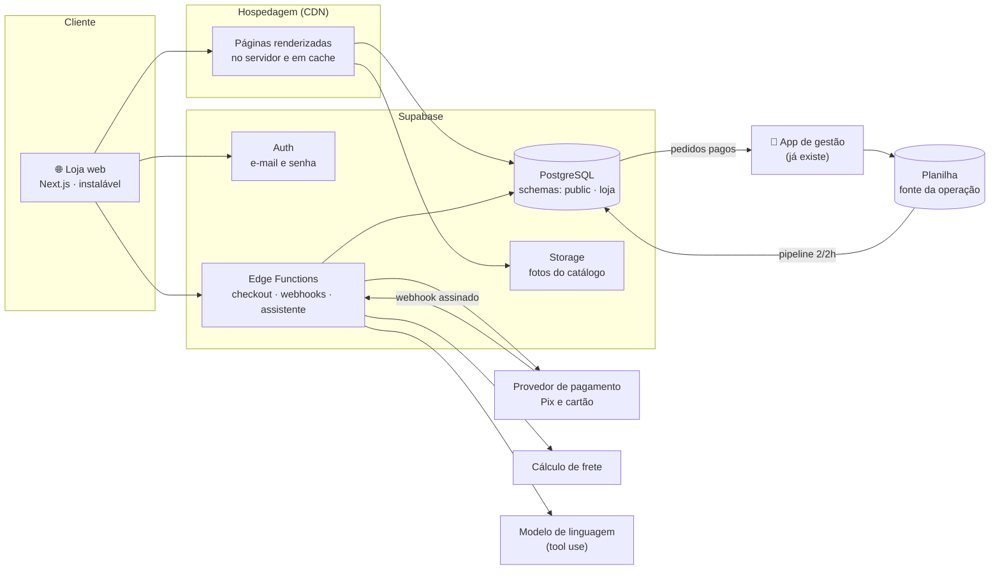
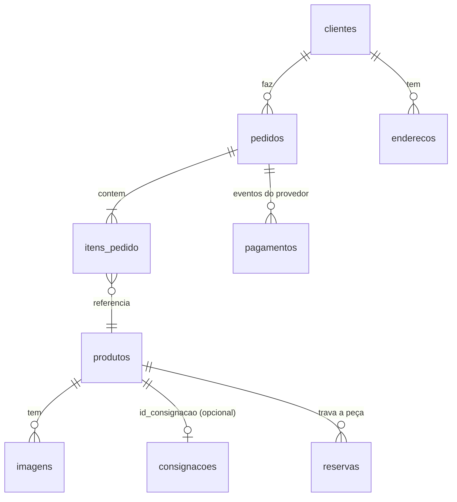

# Loja online da Cairo Special Bikes — documento de arquitetura

> Status: **proposta**, para discussão. Versão 0.1, outubro/2026.
> Escopo: substituir a loja atual (Shopify, mantida por uma agência) por uma loja própria, sobre a mesma plataforma de dados do app de gestão, com um assistente de catálogo para clientes.

---

## 1. Contexto

A Cairo vende bicicletas e componentes em consignação. Hoje a loja online roda na Shopify, com tema e manutenção de uma agência. O custo foi de **R$ 2.500 de implantação e R$ 400/mês de manutenção**.

O projeto de dados já resolveu a operação interna: o app de gestão grava na planilha, o pipeline leva os dados ao Supabase e as views concentram as regras de negócio. A loja online é o próximo passo, com três objetivos:

1. **Custo menor**, com a loja sob controle da própria Cairo.
2. **Catálogo ligado ao estoque real.** Hoje o site e a planilha são mantidos à mão, e itens vendidos continuam publicados.
3. **Um assistente para clientes** que responde sobre o catálogo ("a mais barata, tamanho M, de carbono") e nunca sobre dados financeiros ou de terceiros.

**Restrição de entrega:** o site atual continua no ar até o novo estar pronto e validado. A troca é feita de uma vez, com plano de volta (seção 12).

## 2. O que o site atual revelou

Fonte: `/products.json` e `/collections.json` públicos da loja Shopify, lidos em 02/10/2026.

| Achado | Número | Consequência para o projeto |
|---|---|---|
| Produtos publicados | **190** | O volume é pequeno: banco e busca simples bastam, sem motor de busca dedicado |
| Variantes por produto | **1 em todos** | Cada item é **peça única**. "Estoque" é disponível/vendido, não quantidade, e duas pessoas não podem comprar a mesma bike (seção 6, ADR-4) |
| Disponíveis × indisponíveis | **59 × 131** | Os vendidos continuam publicados. Decidir se viram vitrine de "vendidos" (prova social) ou saem do ar, mantendo as URLs (SEO) |
| Imagens | **1.826** (~10 por produto) | Ficam na CDN da Shopify e **somem quando a conta for encerrada**. Precisam ser copiadas antes (seção 11) |
| `product_type` | **3 categorias com 7+ nomes** ("Bicicleta Road", "Bicicleta de Estrada", "Speed/Road"…; 29 vazios) | Normalização obrigatória, com tabela de mapeamento revisada por pessoa, como foi feito na planilha |
| Tamanho, material, ano | **Não são campos**: estão em tags (`carbono` em 52) e no texto livre | O assistente e os filtros precisam de atributos estruturados. Extração semiautomática com revisão humana (seção 11.3) |
| Descrição (`body_html`) | HTML livre | Conteúdo de terceiro: precisa ser **sanitizado** antes de exibir (seção 8) |
| Coleções | 9 | Viram categorias e filtros; "Página inicial" e "Produtos Premium" são curadoria, não categoria |

## 3. Escopo

**MVP (substitui a Shopify)**
- Vitrine: lista, filtros (categoria, tamanho, material, faixa de preço), busca e página do produto com galeria.
- Conta de cliente: cadastro e login por e-mail e senha, recuperação de senha, endereços, histórico de pedidos.
- Carrinho e checkout com pagamento terceirizado (Pix e cartão) e cálculo de frete.
- Pedido reserva a peça imediatamente; o Cairo confirma e fecha pelo app de gestão.
- Assistente de catálogo para clientes.
- Páginas institucionais, políticas (privacidade, trocas e envio), SEO e sitemap.
- Migração completa do catálogo e das imagens, com as URLs atuais preservadas.

**Depois do MVP:** lista de interesse com alerta ("me avise quando entrar uma speed 54 até R$ 20 mil"), avaliações, cupons, blog, integração com Google Merchant e Instagram Shopping.

**Fora de escopo:** marketplace com vendedores externos, app nativo de loja (a loja é web e instalável), emissão de nota fiscal (fica no sistema que a Cairo já usa).

## 4. Requisitos

### Funcionais (RF)

| ID | Requisito |
|---|---|
| RF-01 | Listar produtos disponíveis com filtros por categoria, tamanho, material e preço, ordenados por relevância, preço ou novidade |
| RF-02 | Página do produto com galeria, atributos, descrição e status (disponível, reservado ou vendido) |
| RF-03 | Cadastro com e-mail e senha, confirmação de e-mail e recuperação de senha |
| RF-04 | Carrinho e checkout: endereço, frete, pagamento por Pix ou cartão no provedor |
| RF-05 | Ao iniciar o pagamento, a peça fica **reservada** por tempo limitado; com o pagamento aprovado, vira pedido pago; com expiração ou recusa, a reserva cai |
| RF-06 | O app de gestão mostra os pedidos pagos para o Cairo fechar a venda; o fechamento marca o item como vendido no site |
| RF-07 | Assistente responde perguntas sobre o catálogo disponível em português, citando os produtos com link |
| RF-08 | O assistente **não** responde sobre faturamento, custos, proprietários (consignantes), outros clientes ou pedidos de terceiros |
| RF-09 | URLs da loja atual (`/products/<handle>`, `/collections/<handle>`) continuam funcionando, com o mesmo conteúdo ou redirecionamento 301 |
| RF-10 | Cliente pode exportar e apagar os próprios dados (LGPD) |

### Não funcionais (RNF)

| ID | Requisito | Meta |
|---|---|---|
| RNF-01 | Desempenho | LCP < 2,5 s em 4G no celular; Lighthouse ≥ 90 em performance, SEO e acessibilidade |
| RNF-02 | Disponibilidade | ≥ 99,5% ao mês, que é o que os provedores gerenciados entregam |
| RNF-03 | Segurança | **OWASP ASVS nível 2** como meta verificável (seção 8). "Segurança máxima" não é mensurável; ASVS L2 é o padrão para aplicações que guardam dados pessoais e pagamentos |
| RNF-04 | Privacidade | LGPD: dados mínimos, base legal, política publicada, exclusão em até 15 dias |
| RNF-05 | Custo de operação | Menor que os R$ 400/mês atuais (seção 13) |
| RNF-06 | Acessibilidade | WCAG 2.1 AA |
| RNF-07 | Manutenibilidade | Cobertura de testes nas regras de negócio, CI obrigatório para merge, infraestrutura descrita em código |
| RNF-08 | Mobile primeiro | Projetada para celular, com o design do app de gestão |

## 5. Arquitetura

**Componentes**

- **Loja web: Next.js (React).** Renderização no servidor e páginas em cache, porque produto e categoria precisam ser indexáveis pelo Google (é o canal de aquisição que a loja atual já tem). Componentes visuais derivados do app de gestão (seção 10).
- **Supabase**, o mesmo projeto do pipeline, com um **schema `loja` separado** do `public` interno (ADR-1):
  - **Auth** para clientes: e-mail e senha, confirmação e recuperação.
  - **PostgreSQL** com RLS em todas as tabelas.
  - **Storage** para as fotos migradas.
  - **Edge Functions** para tudo que usa segredo: criar pagamento, receber webhook, chamar o modelo.
- **Pagamento terceirizado** com checkout do provedor: o cartão nunca passa pelos nossos servidores (ADR-3).
- **Assistente:** Edge Function com ferramentas fixas sobre a view pública do catálogo (ADR-5).
- **App de gestão:** ganha uma aba "Pedidos online" para o Cairo confirmar e fechar a venda, mantendo a planilha como fonte única de escrita do estoque (ADR-4).

## 6. Decisões de arquitetura (ADRs)

**ADR-1: Reaproveitar o Supabase atual, com schema `loja` separado.**
- *Contexto:* o catálogo já está no Supabase (`consignacoes`, `bicicletas`, `vw_catalogo_publico`), com RLS e papéis definidos.
- *Decisão:* a loja usa o mesmo projeto, num schema `loja` com tabelas próprias de produto, pedido e cliente, e lê o estoque por views.
- *Consequências:* uma fonte de verdade e nenhuma sincronização entre bancos. O risco é a loja (pública) e a gestão (interna) dividirem o mesmo banco, mitigado por schemas, papéis e RLS sem nenhuma policy pública nas tabelas internas. **Alternativa rejeitada:** um banco separado, porque exigiria um segundo pipeline e criaria duas verdades sobre o estoque.

**ADR-2: Next.js com renderização no servidor, em hospedagem com CDN.**
- *Contexto:* SEO é crítico (as URLs atuais já ranqueiam), e o público está no celular.
- *Decisão:* páginas de produto e categoria renderizadas no servidor e revalidadas quando o catálogo muda.
- **Alternativa rejeitada:** SPA puro, que é ruim para indexação e para a primeira carga no 4G.

**ADR-3: Nunca tocar dados de cartão.**
- *Decisão:* o checkout é hospedado ou embutido pelo provedor de pagamento (Mercado Pago, Pagar.me ou Stripe; ver seção 15). O nosso sistema guarda só o ID e o status do pagamento.
- *Consequência:* o escopo de PCI-DSS cai para o mínimo (questionário SAQ A). A confirmação vem **só** pelo webhook assinado do provedor, nunca pelo redirecionamento do navegador, que pode ser forjado.

**ADR-4: Peça única: reserva no site, baixa definitiva pela planilha.**
- *Contexto:* cada bike existe uma vez, e a planilha é a fonte única de escrita da operação. Esse princípio resolveu os status divergentes que existiam entre as abas.
- *Decisão:*
  - Iniciar o pagamento cria uma **reserva** em `loja.reservas` com prazo (30 min para Pix, a duração da sessão para cartão), com trava no banco: uma *exclusion constraint* impede duas reservas ativas para a mesma peça.
  - Pagamento aprovado vira `loja.pedidos` com status `pago`, e a peça some da vitrine na hora.
  - O app de gestão mostra os pedidos pagos, e o Cairo fecha a venda **pelo app**, que grava na planilha (canal "Online"). O pipeline leva o fechamento ao banco.
- *Consequência:* nenhuma venda dupla, e a planilha continua sendo a única escrita do estoque. O custo é um atraso de até 2h entre a venda e o status oficial no banco, coberto pela reserva, que já tira a peça da vitrine.
- **Alternativa rejeitada:** o site gravar direto na planilha, porque exporia credencial de escrita na nuvem pública e criaria um segundo ponto de escrita.

**ADR-5: Assistente com ferramentas fixas, sobre uma view sem dados sensíveis.**
- *Contexto:* é o mesmo raciocínio do assistente interno, que não escreve SQL: um modelo gerando consulta livre decide sozinho regras e alcance. Aqui pesa mais, porque o usuário é anônimo.
- *Decisão:*
  - A Edge Function expõe ferramentas tipadas: `buscar_produtos(categoria, tamanho, material, preco_max, ordenar)`, `detalhe_produto(id)` e `categorias()`.
  - Cada ferramenta faz uma consulta **parametrizada** sobre `loja.vw_vitrine`, uma view que **não tem as colunas** de custo, consignante, contato ou dias em loja. A proteção não é um filtro: as colunas não existem.
  - A função roda com um papel que só tem `SELECT` nessa view.
  - Há limite de taxa por IP e por sessão, e teto de tokens por conversa.
- *Consequência:* injeção de SQL pelo assistente é impossível por construção (não há SQL dinâmico), e prompt injection não alcança dado sensível porque ele não existe no alcance do papel.

**ADR-6: Migração por snapshot diário, com fotos copiadas.**
- *Decisão:* um job agendado (GitHub Actions, uma vez por dia) baixa o `products.json` paginado e grava um snapshot versionado com o diff do dia anterior. As fotos novas vão para o Storage do Supabase.
- *Consequência:* no dia da troca, o catálogo e as fotos já estão inteiros do nosso lado, e o histórico de diffs mostra o que mudou na loja antiga durante o desenvolvimento.

## 7. Modelo de dados (schema `loja`)

- **`produtos`:** handle (URL), título, descrição sanitizada, categoria normalizada, marca, modelo, ano, tamanho, material, preço, status (`disponivel`, `reservado`, `vendido`, `oculto`), `id_consignacao` (liga ao estoque da planilha), `shopify_id` (rastreio da migração).
- **`imagens`:** caminho no Storage, ordem, texto alternativo, largura e altura.
- **`clientes`:** 1:1 com `auth.users`, com nome, telefone e consentimentos LGPD (marketing, com data e versão da política).
- **`reservas`:** produto, cliente, expira em, com uma *exclusion constraint* que impede duas reservas ativas para o mesmo produto.
- **`pedidos`, `itens_pedido` e `pagamentos`:** guardam o status, o valor, o frete e o ID do provedor. `pagamentos` é **somente anexação**: cada evento do webhook vira uma linha, e o status do pedido é derivado delas.
- **`vw_vitrine`:** a view pública, com o produto disponível ou reservado e os atributos e fotos. Só ela tem `SELECT` para os papéis `anon` e do assistente.

**RLS**

| Tabela | Quem lê | Quem escreve |
|---|---|---|
| `clientes`, `enderecos` | o próprio cliente (`auth.uid() = id`) | o próprio cliente |
| `pedidos`, `itens_pedido` | o próprio cliente | só as Edge Functions (`service_role`) |
| `reservas`, `pagamentos` | ninguém pelo cliente | só as Edge Functions |
| `produtos`, `imagens` | só via `vw_vitrine` | só o job de catálogo |

Nenhuma tabela do schema `public` (gestão) ganha policy para `anon` ou `authenticated` da loja.

## 8. Segurança

Meta: **OWASP ASVS 4.0 nível 2**, verificada item a item antes do lançamento, com testes automatizados no CI.

### 8.1 Ameaças (STRIDE resumido)

| Ameaça | Exemplo | Controle |
|---|---|---|
| **S**poofing | roubo de conta, força bruta no login | Supabase Auth com confirmação de e-mail; senha de 10+ caracteres verificada contra vazamentos conhecidos; limite de tentativas e CAPTCHA (Cloudflare Turnstile) no cadastro, login e recuperação; MFA opcional |
| **T**ampering | alterar preço ou pedido pelo navegador | preço e total **sempre recalculados no servidor**; o navegador só envia IDs; webhook com assinatura verificada |
| **R**epudiation | "não fiz esse pedido" | `pagamentos` só cresce; logs de auth e de pedido com horário e IP |
| **I**nformation disclosure | ler pedido ou endereço de outro cliente; assistente vazar dado interno | RLS por `auth.uid()`; `vw_vitrine` sem colunas sensíveis; o assistente só alcança essa view |
| **D**enial of service | robô consumindo o assistente ou o login | limite por IP e sessão; teto de tokens; CDN na frente |
| **E**levation of privilege | cliente virar admin | sem papel de admin na loja: a administração é o app de gestão (outro canal); `service_role` só nas Edge Functions, nunca no navegador |

### 8.2 Controles por camada

- **Injeção de SQL:** nenhum SQL montado com texto. Acesso pelo cliente oficial do Supabase (PostgREST), que é parametrizado, e por funções `rpc` com parâmetros tipados. Funções `SECURITY DEFINER` com `search_path` fixo. Teste ativo com **sqlmap** contra o ambiente de homologação em cada release.
- **XSS:**
  - o `body_html` vindo da Shopify passa por sanitização no servidor (lista de tags permitidas), e texto de usuário nunca entra como HTML;
  - **CSP** estrita com nonce, sem `unsafe-inline` em script.
- **Cabeçalhos HTTP:** HSTS, `X-Content-Type-Options`, `Referrer-Policy`, `Permissions-Policy` e `frame-ancestors 'none'`.
- **Sessão:** tokens em cookie `HttpOnly`, `Secure` e `SameSite=Lax`, com renovação do token, e proteção CSRF nas ações que alteram estado.
- **Validação:** esquema (zod) na entrada de toda Edge Function. Tudo que vem do navegador é tratado como hostil, como na rodada de QA do app de gestão.
- **Segredos:** chaves só em variáveis de ambiente das funções; `.env` fora do Git; varredura de segredos no CI.
- **Dependências:** Dependabot, `npm audit` e CodeQL no CI.
- **Assistente:**
  - prompt de sistema tratando nome e descrição de produto como dado, nunca como instrução;
  - ferramentas somente leitura;
  - teste com um conjunto de ataques conhecidos de prompt injection a cada mudança de prompt.
- **LGPD:**
  - dados mínimos (nada de CPF antes da compra);
  - consentimento separado para marketing;
  - política publicada, exportação e exclusão de conta;
  - registro de operações de tratamento;
  - contrato de operador (DPA) com Supabase, provedor de pagamento e provedor do modelo.

### 8.3 Testes de segurança

| Teste | Ferramenta | Quando |
|---|---|---|
| Policies de RLS: cada papel tenta ler e escrever cada tabela | **pgTAP** | todo PR |
| SAST e dependências | CodeQL, Dependabot, `npm audit` | todo PR |
| Varredura de segredos | gitleaks | todo PR |
| DAST: varredura passiva do site | **OWASP ZAP** baseline | todo deploy em homologação |
| Injeção de SQL ativa | **sqlmap** nos endpoints e RPCs | antes de cada release |
| Autenticação: força bruta, enumeração de e-mail, troca de senha, sessão | roteiro manual ASVS V2/V3 e testes Playwright | antes do lançamento |
| Autorização: IDOR (pedido de outro cliente) | testes Playwright com duas contas | todo PR |
| Pagamento: webhook forjado, valor alterado, pagamento duplicado | testes de integração com payloads assinados e não assinados | todo PR |
| Assistente: prompt injection e vazamento | conjunto de ataques com respostas esperadas | toda mudança no assistente |
| Revisão geral | checklist ASVS L2 completo | antes do lançamento |

## 9. Estratégia de testes

- **Unidade (Vitest):**
  - cálculo de total e frete;
  - normalização de categoria e atributos;
  - sanitização de HTML;
  - leitura de valores e datas.
- **Integração:**
  - Supabase local (Docker) com as migrations aplicadas;
  - pgTAP para RLS e para a trava de reserva (duas reservas simultâneas, exatamente uma vence);
  - webhooks com payloads reais do provedor.
- **Ponta a ponta (Playwright):**
  - navegar, filtrar, cadastrar, comprar com o sandbox do provedor, reservar e expirar;
  - rodar em **Chromium e WebKit**, porque o bug de layout que só apareceu no Safari do iPhone, no app de gestão, é exatamente o tipo de coisa que o WebKit no CI pega.
- **Avaliação do assistente:** perguntas com gabarito calculado pelas próprias ferramentas, no mesmo modelo do `testarConfiguracao` do app de gestão, mais as perguntas proibidas (faturamento, consignantes), que devem ser recusadas.
- **Não funcionais:** Lighthouse CI com orçamento de performance, axe para acessibilidade e um teste de carga leve no checkout e no assistente.

## 10. Design

O mesmo sistema visual do app de gestão, extraído para tokens compartilhados:
- **Cor, tipografia e superfícies:** tokens de cor com claro e escuro, Inter, cantos arredondados e o brilho pêssego.
- **Peças visuais:** a bike em traço como elemento de marca, e o logo original sobre fundo escuro.

Componentes reaproveitados: cartão de item (com o corte "…" que funciona no Safari), folha que sobe do rodapé (filtros e assistente), chips de filtro, busca sem acento e esqueleto de carregamento.

## 11. Migração do catálogo

1. **Snapshot diário** do `products.json` (paginado, 250 por página) e do `collections.json`, com diff versionado (ADR-6).
2. **Cópia das fotos** para o Storage, com o nome derivado do ID da imagem Shopify (idempotente), e conversão para WebP em vários tamanhos.
3. **Normalização com revisão humana:**
   - categoria: tabela de mapeamento dos 7+ `product_type` para 3–5 categorias;
   - atributos: extração de tamanho, material e ano de tags, título e descrição por regras, e um modelo de linguagem só para sugerir onde as regras falham;
   - revisão: **toda sugestão é revisada por pessoa** numa planilha antes de entrar. É o mesmo princípio do `correcoes.csv`: mudança na fonte tem trilha.
4. **Conciliação com a planilha:** casar cada produto do site com a consignação correspondente (`id_consignacao`), separando o que só existe no site, o que só existe na planilha e o que diverge de preço ou status. A conciliação que já foi feita entre a planilha e o Excel da loja é o modelo.
5. **Mapa de URLs:** cada `/products/<handle>` e `/collections/<handle>` atual tem destino. Nenhuma URL indexada pode virar 404.

**Contas de clientes:** senhas da Shopify não podem ser exportadas (são armazenadas com hash). Os clientes recebem um convite para criar a senha no primeiro acesso. A lista de clientes e o histórico de pedidos vêm da exportação CSV do painel da Shopify, feita pelo Cairo, e não do JSON público.

## 12. Ambientes, CI/CD e troca

- **Ambientes:**
  - *local:* Supabase em Docker com dados fictícios, gerados como no `demo/gerar_dados_demo.py`;
  - *homologação:* deploy de cada PR, com o sandbox do pagamento;
  - *produção.*
- **CI obrigatório para merge:** lint, tipos, testes de unidade e integração, pgTAP, Playwright (Chromium e WebKit), CodeQL, gitleaks e Lighthouse.
- **Banco:** migrations versionadas no Git (`supabase/migrations`); nada de alteração manual em produção.
- **Troca de domínio (cutover):**
  1. TTL do DNS reduzido 48h antes.
  2. Último snapshot e conciliação.
  3. Congelamento de alterações na loja antiga.
  4. Troca do DNS e verificação com roteiro: compra real de valor baixo, estornada.
  5. **A Shopify continua ativa por 30 dias.** Se algo crítico falhar, o DNS volta em minutos.
  6. Sitemap enviado ao Search Console e acompanhamento de erros 404 e de indexação.

## 13. Custos (estimativa, conferir antes de contratar)

| Item | Hoje | Proposta |
|---|---|---|
| Plataforma de loja | Shopify (incluso nos R$ 400?) | — |
| Manutenção da agência | R$ 400/mês | — |
| Hospedagem web (CDN) | — | R$ 0–110/mês (camada gratuita que permite uso comercial, ou plano pago) |
| Supabase | já pago pelo projeto de dados | **plano Pro, ~US$ 25/mês** (o gratuito pausa projetos inativos, inaceitável para uma loja) |
| Modelo do assistente | — | provavelmente < R$ 50/mês no volume de uma loja, com teto de gasto configurado |
| Domínio | já existe | — |
| Taxas de pagamento | as atuais | as do provedor escolhido; negociar Pix |

Estimativa: **R$ 150–300/mês**, contra R$ 400 de manutenção mais a mensalidade e as taxas da Shopify. Os preços dos provedores mudam: confirmar na contratação.

## 14. Roadmap

| Fase | Entrega | Critério de pronto |
|---|---|---|
| **0. Fundação** (1–2 semanas) | Repositório, CI, Supabase local, tokens de design, schema `loja` e RLS com pgTAP | Pipeline verde com testes de RLS |
| **1. Catálogo** (2 semanas) | Snapshot diário, cópia das fotos, normalização, conciliação, vitrine e página de produto | 190 produtos migrados, mapa de URLs completo, Lighthouse ≥ 90 |
| **2. Contas** (1 semana) | Cadastro, login, recuperação, perfil, LGPD | Checklist ASVS V2 e V3 ok; testes de IDOR verdes |
| **3. Checkout** (2–3 semanas) | Carrinho, frete, reserva, pagamento, webhook, aba "Pedidos online" no app | Compra no sandbox de ponta a ponta; corrida de reserva testada; webhook forjado recusado |
| **4. Assistente** (1–2 semanas) | Edge Function, ferramentas e avaliação | Gabarito 100%; perguntas proibidas recusadas; prompt injection contido |
| **5. Endurecimento** (1–2 semanas) | ZAP, sqlmap, ASVS L2 completo, carga e acessibilidade | Nenhum achado alto ou crítico aberto |
| **6. Troca** | Cutover com volta garantida | 30 dias sem incidente crítico; Shopify cancelada |

## 15. Riscos

| Risco | Impacto | Mitigação |
|---|---|---|
| Perda de SEO na troca | Alto | URLs preservadas e 301; sitemap; Search Console; troca fora de época de pico |
| Venda dupla de peça única | Alto | Reserva com trava no banco (ADR-4) e teste de concorrência |
| Fotos perdidas ao cancelar a Shopify | Alto | Cópia diária (ADR-6) antes de qualquer cancelamento |
| Atributos (tamanho, material) errados | Médio | Extração com revisão humana; o assistente cita a ficha do produto |
| Direitos sobre conteúdo do site atual (textos, fotos, tema) | Médio | Confirmar no contrato com a agência o que pertence à Cairo; o design novo é próprio (baseado no app) |
| Assistente inventando informação | Médio | Ferramentas devolvem a resposta pronta; avaliação com gabarito; o modelo não completa número que a ferramenta não deu |
| Equipe de uma pessoa | Médio | Serviços gerenciados, testes automatizados e documentação, para não criar uma nova dependência como a da agência |

## 16. Decisões em aberto (para o Cairo)

1. **Provedor de pagamento:** Mercado Pago, Pagar.me ou Stripe. Comparar taxas de Pix e cartão, prazo de recebimento e parcelamento.
2. **Frete:** retirada na loja, transportadora própria ou um agregador de frete. Bike exige embalagem e seguro.
3. **Itens vendidos:** continuam visíveis como "vendido" (prova social e SEO) ou saem do ar com redirecionamento?
4. **Parcelamento sem juros:** em até quantas vezes, e quem absorve a taxa?
5. **Contas de clientes:** existem muitas contas cadastradas na Shopify hoje? (Define o esforço do convite de migração.)
6. **O que o contrato com a agência diz sobre os textos e as fotos** do site atual.
